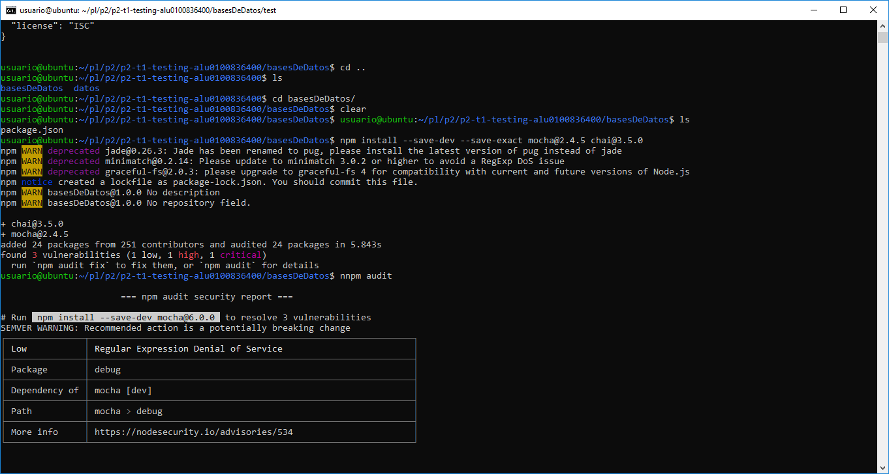
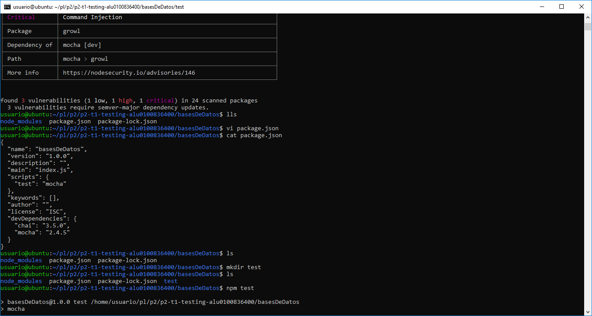
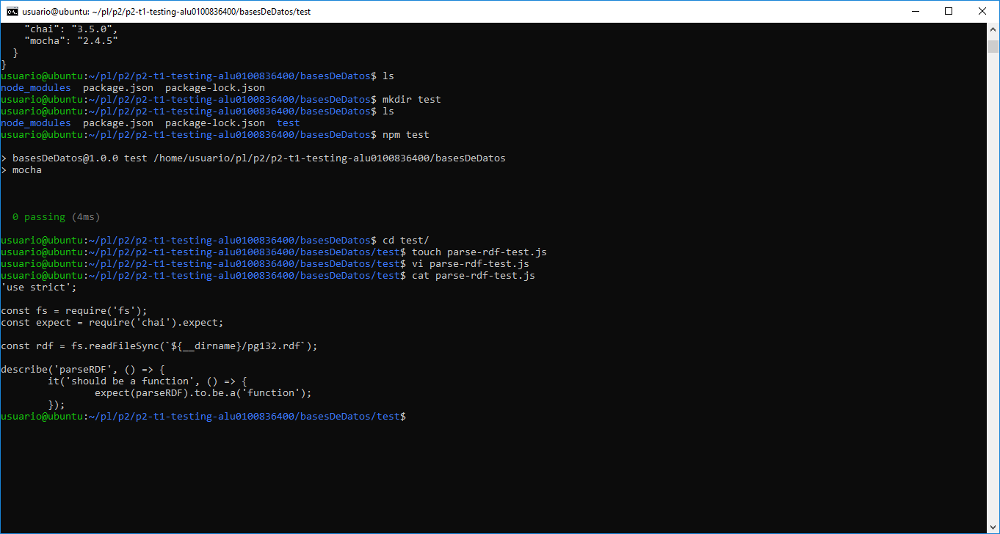
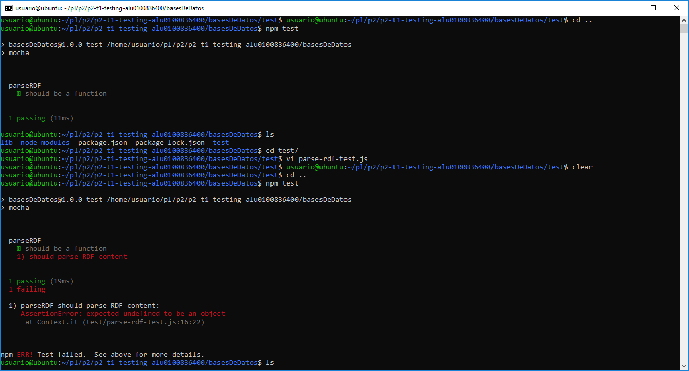
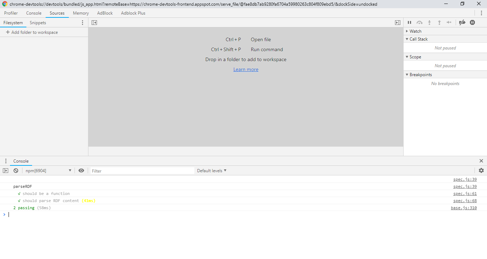
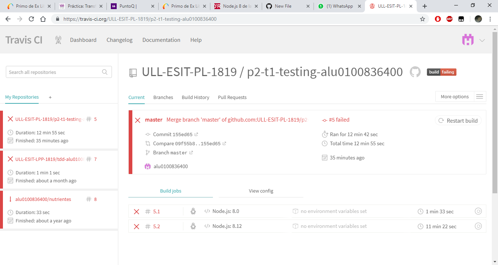

# p2-t1-testing-alu0100836400
p2-t1-testing-alu0100836400 created by GitHub Classroom

Instalamos mocha y chai

Actualizamos package.json

Creamos directorios y los archivos parse y test
Desarrollamos el código siguiendo BDD

Usando inspect

Integración continua con Travis

